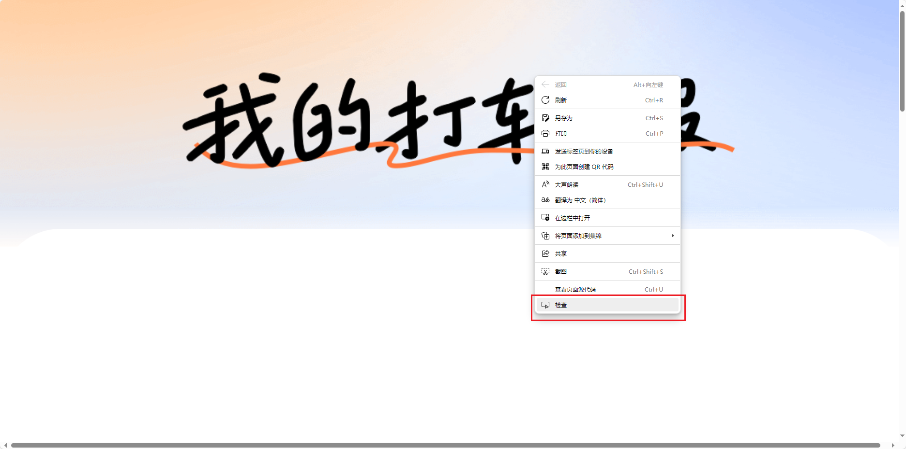

# 滴滴账单集成


🔖 实时同步滴滴出行月度消费数据到Home Assistant

## 🚀 功能特性
- 实时显示当月滴滴出行总消费金额（精确到分）
- 展示行程次数、总时长、总距离等详细数据
- 自动更新账单月份标识
- 支持自定义API更新间隔（15-1440分钟）
- 异常数据自动回退机制

## 📦 安装要求
- Home Assistant 2023.9 或更高版本
- Python 3.10+
- 有效的滴滴账单API访问权限

## 🔧 安装配置
1. 将本集成放入`custom_components/didi_bill`目录
2. 重启Home Assistant服务
3. 通过【配置】->【设备与服务】添加新集成
4. 输入有效的滴滴账单API地址

## 🔧 电脑抓包
> 点击[滴滴账单URL]()进入滴滴账单;
> 
> 
> 快捷键F12或者右键选择检查进入开发人员工具界面；
> 
> 
> 
> 自行登录开始抓包; 
> 
> .png)
> 
> 登录成功后,找到账单请求.
> 
> 如果无法找到,可以尝试刷新页面.
> 
> .png)
> 
> 获取请求地址；
> 
> .png)
> 
> 一般来说,在浏览器中输入该地址就会得到对应的响应json文件.可使用该操作判断url是否失效.
> 
> 如下图:
> 
> .png)
>

## ⚙️ 配置参数
| 参数名 | 类型 | 必填 | 默认值 | 说明 |
|--------|------|------|--------|-----|
| `api_url` | string | 是 | 无 | 数据接口地址（需HTTPS） |
| `update_interval` | integer | 否 | 30 | 刷新频率（分钟） |

## 📊 实体属性
```yaml
# 主要状态值
state: 158.50  # 当月消费金额（单位：元）

# 扩展属性（extra_state_attributes）
count: 12       # 当月行程次数
time: 460       # 总行程时长（分钟）
distance: 68.4  # 总行程距离（公里）
month: "2024-01" # 账单月份
unit_of_measurement: "CNY" # 计量单位
```

## 🛠️ 高级配置
通过`configuration.yaml`设置全局默认值：
```yaml
didi_bill:
  api_url: https://api.didi.com/v3/bills
  update_interval: 60
```

## ❓ 常见问题
### 数据不更新
✅ 检查步骤：
1. 确认API返回JSON包含以下结构：
```json
{
  "data": {
    "travel_cost": 15850,
    "travel_count": 12,
    "charge_duration": 460,
    "travel_distance": 68400,
    "title": "{2024-01}"
  }
}
```
2. 检查集成日志：`homeassistant.components.didi_bill`
3. 验证网络连通性：`telnet api.didi.com 443`

### 属性显示不全
✅ 确保：
- API响应包含完整字段
- 集成版本 ≥ 1.1.0
- 已授予`homeassistant`用户读取权限

## 📄 开发文档
```python
class DiDiBillSensor(CoordinatorEntity, Entity):
    """滴滴账单传感器实体

    属性:
    - coordinator: 数据协调器实例
    - entry: 配置条目对象
    """

    def __init__(self, coordinator, entry):
        super().__init__(coordinator)
        self._attr_unique_id = f"didi_bill_{entry.entry_id}"
        # ...其他初始化逻辑...
```

## 📜 许可证
MIT License - [查看完整协议](LICENSE)
